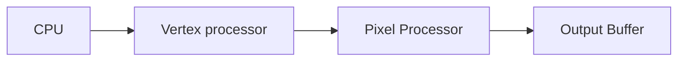

export const metadata = {
  title: 'NVIDIA Tesla',
  date: '2026-05-18',
  description: 'A Unified Graphics and Computing Architecture',
}

# Procastination

Dear reader, let me rant a bit about my current situation. I have a presentation tomorrow for my HPC Architecture class, where I will be explaining **NVIDIA's Tesla architecture**. I thought I would be a good idea to first explain to you how the architecture works before creating the slides for tomorrow. Sadly, I am writing all this in a rush, because I decided not to work yesterday (I was resting from a half marathon). 
Hopefully, writing this blog post will help me to organize my mind, and to get an idea of what exactly to say and discuss on the presentation.

# Introduction

Today we will be discussing the **NVIDIA's Tesla architecture**, the first architecture to unify the graphics pipeline into one single component, and to allow for programmable parallel computation. I will use the paper `"NVIDIA Tesla: A Unified Graphics and Computing Architecture"` [(pdf)](https://www.cs.cmu.edu/afs/cs/academic/class/15869-f11/www/readings/lindholm08_tesla.pdf) for reference.

```bibtext color="#888888"
@ARTICLE{4523358,
  author={Lindholm, Erik and Nickolls, John and Oberman, Stuart and Montrym, John},
  journal={IEEE Micro}, 
  title={NVIDIA Tesla: A Unified Graphics and Computing Architecture}, 
  year={2008},
  volume={28},
  number={2},
  pages={39-55},
  keywords={Graphics;Computer architecture;Parallel processing;Pipelines;Concurrent computing;Load management;Multicore processing;Parallel programming;Portable computers;Workstations;Hot Chips 19;GPU;parallel processor;SIMT;SIMD;unified graphics and parallel computing architecture;graphics processing unit;cooperative thread array;Tesla},
  doi={10.1109/MM.2008.31}}
```

Its almost a 20 year old paper, that allowed me to understand the rational behing **graphics processing** and **parallel streaming** processing.

During the blog post, I will take a reverse approach to the one proposed in the white paper. I will showcase the architecture more clearly if I start **bottom-up**, from the smallest of the components, until we get the full picture. Personally I not like to build the house starting from the roof.

## But why Tesla?

I had the opportunity to choose from different papers that cover foundational topics in computer architecture, such as the **Apple M1 family**, **AWS Gravitor 4**, **Nvidia Blackwell/GraceHopper**, etc. I ended up choosing the Tesla architecture for two main reasons:

- I have been working on GPU memory transaction optimizations over the semester (I will write a blog about it some day).
- Specifically, Tesla, was the first to introduce _General Purpose Computing_ (GPGPU) with CUDA, not only limited to graphics processing.

I believe it is quite a must today to know how GPUs work, so here is my try to begin the exploration of the GPU rabbit hole.

# Graphic Processing Units

First, we need to set the grounds with what a GPU is for. The demand of **realistic** interaction with a computer has been rising ever since; we as humans strive to recreate our world within these digital logic machines we call computers. 

From videogames, to special effects, to physics simulators, we have created many programs that recreate real experiences, such as 3D objects, ray light tracing and gravity interactions. All this workload differs from classic computations, such as database lookups or text rendering, specifically, they differ in the pattern they treat data: they manipulate many **indepentent** data units with simple instructions.

A classic CPU is prepared for non-symmetric programs that are very hard to predict long term, and might have almost random patterns (remember that the OS is contantly scheduling many programs in the same CPU). Engineers and Researchers realised that there is a need for a separate unit that allows the machine to execute this independent operations in a parallel way, without interfering with the normal CPU load. This is why GPUs were created, for **Graphics Computing**.

As of 2026, when you think about GPUs, your mind goes directly to *Machine Learning*, specifically *Large Language Models*, where parallel independent computations speed up their inferences. It might not be the best idea to ignore GPU usage for Machine Learning, but for the sake of the blog post, I want to get in the head of the architects back when the architecture was first presented.

In order to understand the decisions and goals of the architects, we need to understand the state of the art in Graphics Computing back in 2006.  For that, lets set the some definitions:

- **Geometric primitives**: points, lines, and triangles.
- **Rasterization**: process of turning geometric primitives into screen pixels.
- **Vertex processors**: unit resposible to manipulate geometric primitives.
- **Pixel processors**: unit resposible to manipulate rasterized output.

With this brief introduction we have a good starting point for our technical journey.

## History

Historicaly, traditional 3D pipeline consisted of **fixed** multi-staged processes that separated different rendering tasks into specialized hardware units:




The first GPU ever designed in 1991, the `NVIDIA GeForce 256`, implemented this pipeline with a 32 floating point vertex processor together with a fixed function pixel-fragment pipeline.

This rigid traditional strucure is **inefficient** for graphic worloads, in cases where a GPU is rendering large triangles the pixel processors would be completely overloaded while the vertex processors would be idle. Conversely, in a scene with a large amount of tiny triangles, the vertex processor would be bottlenecked while pixel processors have not much to do. 

Eventually, the need for **load balancing** of increasingly complex applications pushed the industry to abandon this fixed model and move towards a unified architecture:

- `2001 GeForce 3`: introduced a programmable vertex processor together with a configurable 32 floating point pixel processor.
- `2002 Radeon 9700`: included a programmable 24 floating point pixel processor.
- `2003 GeForce FX`: upgraded the programmable pixel processor to 32 floating point operations.
- `2005 Xbox 360 Xenox`: introduces the first early unification of the vertex and pixel processor.


# NVIDIA Tesla Architecture

The NVIDIA Tesla Architecture was presented at final unified pipeline, that replaces the vertex and pixel processors into a single `Streaming Multiprocessor` (SM), capable of load balancing the workloads dinamically on the fly. Not only that, but also included new graphic stages, specifically _geometry shaders_, and general purpose computing, which allows developer to write non-graphical high-performance computing applications in the **CUDA extension for C/C++**. A unified architecture also reduces costs by having one single development team, and allows for sharing expensive hardware units.

## Tesla Execution Units 

Analogous to the CPU, the Tesla GPU contains several **cores** (`Streaming Multiprocessor`) with a number of **threads** each (`Streaming Processor`).

The `Streaming Processor` (SP) is a fully **pipelined** execution unit in the architecture that performs the core operations of a program.

The _Instruction Set Architecture_ is register based, allowing for floating point, integer and bit operations, branches and jumps, loads and stores in memory and some texture specific operations. The load and store operations are defined by the different memory levels accesible from an **SP**:

- **Local**: temporal, private, per-thread memory.
- **Shared**: used by cooperating **SP** within one **SM**.
- **Global**: external DRAM.
                           
```text
               ┌───┐    
┌───────┬───┐  │   │    
│┌─┬──┐ │S M│  │   │    
││ │SP│ │H E├─►│ D │    
│└─┴──┘ │A M│  │ R │    
│┌─┬──┐ │R O│  │ A │    
││ │SP│ │E R│◄─┤ M │    
│└─┴──┘ │D Y│  │   │    
└───────┴───┘  │   │    
               └───┘    
```
                                    
The **SM** is the working union of **SPs** that allows for multipurpose computations (Graphics and General Purpose). In the NVIDIA Tesla architecture a **SM** consists of exactly 8 **SP**, together with two fixed computing units called `Function Units`, which calculate _transcendental functions_ (cosine, sine, binary logarith, ...). Each **SP** has its own instruction pointer and state registers.

```text
┌────────────────────────┐ 
│           SM           │ 
│┌──┐ ┌──┐ ┌──┐ ┌──┐ ┌──┐│ 
││SP│ │SP│ │SP│ │SP│ │FU││ 
│└──┘ └──┘ └──┘ └──┘ └──┘│ 
│┌──┐ ┌──┐ ┌──┐ ┌──┐ ┌──┐│ 
││SP│ │SP│ │SP│ │SP│ │FU││ 
│└──┘ └──┘ └──┘ └──┘ └──┘│ 
└────────────────────────┘
```

The **SM** follows a **Single Instruction Multiple Thread** architecture, where a program may instantiate many computation threads, and the **SM** will concurrently execute these threads in groups of 32 called _warps_. 

The **SM** module will fetch the instructions and then issue them to the **SPs** through the `Multi-Threaded Fetch/Issue` unit (MT Issue). 

It is important to note that all the threads in a _warp_ execute the same code, so the **SM** will issue the same instructions to the threads, so if any thread has a branch and will execute different code, the **SM** will have to stall in order to execute the different set of divergent threads in the _warp_. This instruction stall is called **Thread Divergence**, which is something that we want to avoid during computation. 

To allow for temporal/spatial locality, the **SM** unit also contains caches both for read only data and instructions. 

```text
┌──────────────────────────────────┐    
│                SM                │    
│┌───┐┌──┐ ┌──┐ ┌──┐ ┌──┐ ┌──┐┌───┐│    
││   ││SP│ │SP│ │SP│ │SP│ │FU││S M││    
││   │└──┘ └──┘ └──┘ └──┘ └──┘│H E││    
││ M │                        │A M││    
││ T │                        │R O││    
││   │┌──┐ ┌──┐ ┌──┐ ┌──┐ ┌──┐│E R││    
││   ││SP│ │SP│ │SP│ │SP│ │FU││D Y││    
│└───┘└──┘ └──┘ └──┘ └──┘ └──┘└───┘│    
│     ┌──────────┐┌──────────┐     │    
│     │ R-O DATA ││   INST   │     │    
│     └──────────┘└──────────┘     │    
└──────────────────────────────────┘    
```

The flow execution of a _warp_ in the Tesla architecture is the following:
1. The **SM Scheduler** chooses a _warp_ from a pool of 24 _warps_.
2. Half of the _warp_ (16 threads) are execute concurrently on the 8 **SPs** over 2 cycles.
3. The other half executes in 2 cycles.

The timing on the execution works because the _warp_ scheduler in the **SM** operates at half the clock rate of the **SP** units (meaining that by each issued _warp_, two groups of 16 threads can be executed). The Scheduler will choose the next _warp_ to execute based on the _warp_ type, instruction type and fairness score.

## Building Blocks

We could think that we have already defined the building blocks of the Tesla architecure, and that we could scale by just replicating **SMs** horizontally. But that is not the case, we still need to manage the **SMs** and allow them to execute all types of workloads including **graphics processing** and **parallel computing**. This is where the architects introduced the actual scalable building blocks of this architecure, the `Texture/Processor Clusters` (TPC).

A **TPC** consists of 2 **SMs** managed by an **SM** Controller, together with a shared Texture Unit and a Geometry Controller:

- The `SM Controller` assembles input workloads and packs them into warps which load balances to the **SMs**. It also arbitrages the **SM** acces to the texture unit, load/store and I/O paths.
- The `Texture Unit` inputs texture coordinates and output filtered RGBA colors. It contains the first level of cache for texture data.
- The `Geometry Controller` recirculates the **SM** output back to process another step of the graphical pipeline.


```text
┌──────────┐
│   T/PC   │
│┌────────┐│
││   GC   ││
│└────────┘│
│┌────────┐│
││  SM-C  ││
│└────────┘│
│┌──┐  ┌──┐│
││SM│  │SM││
│└──┘  └──┘│
│┌────────┐│
││   TU   ││
││ ┌────┐ ││
││ │ L1 │ ││
││ └────┘ ││
│└────────┘│
└──────────┘
```

**TPCs** are fully independently **scalable** and can be increased in number to increase the throughput of the GPU. Because of their modularity, hardware designer can easily scale them to fit different needs: from an entry level GPU with one **TCP** to a high performance GPU with 8 **TCP** (e.g NVIDIA GeForce 8800). The group of **TPC** that computes is called the `Streaming Processor Array`.

                                    
```text
┌───────────────────────────┐     
│            SPA            │     
│┌────┐┌────┐┌────┐   ┌────┐│     
││T/CP││T/CP││T/CP│...│T/CP││     
│└────┘└────┘└────┘   └────┘│     
└───────────────────────────┘     
```

## Input and Output

### Pre/Post processing

Now that the core comupation hardware is set up, the right data has to be distributed to the **SPA**. For this, the Tesla architecure uses 5 different units:

- The `Input Assembler`: collects geometric primitives along with its shapes and forwards them to the Vertex Work Distribution unit.
- The viewport/clip/setup/raster/zcull block (`Rasterizer`): rasterizes the input (translates 3D primitives to 2D) and then directs the data to the Pixel Work Distribution unit.
- `Vertex/Pixel/Compute Work Distribution` units: they are the hardware in charge of correctly asigning the work to be done in the different **TCPs**.


Then, after the **TCPs** have finshed processing the workload, they can send the output to the `Raster Operation Processor` (ROP) which its job is to perform color an depth operations directly on memory. On the Tesla Architecture is **ROP** is paired with a specific memory parition, to ensure that memory traffic originates locally. 

```text
┌───────────────────────────────────────────┐ 
│┌───────────────┐ ┌──────────┐        GPU  │ 
││Input Assembler│ │Rasterizer│             │ 
│└──────┬────────┘ └────┬─────┘             │ 
│       │               │                   │ 
│  ┌────┴────┐     ┌────┴───┐   ┌──────────┐│ 
│  │Vertex WD│     │Pixel WD│   │Compute WD││ 
│  └────┬────┘     └────┬───┘   └──┬───────┘│ 
│       │               │          │        │ 
│       └──┬───┬───┬───┬┴──┬───┬───┴──┐     │ 
│       ┌──┴───┴───┴───┴───┴───┴───┐  │     │ 
│       │          SPA             │  │     │ 
│       └────┬───┬────┬──────┬────┬┘  │     │ 
│       ┌────┼───┼────┼──────┼────┼───┘     │ 
│      ┌┴─┐┌─┴─┐┌┴─┐┌─┴─┐   ┌┴─┐┌─┴─┐       │ 
│      │L2││ROP││L2││ROP│...│L2││ROP│       │ 
│      └──┘└───┘└──┘└───┘   └──┘└───┘       │ 
└───────────────────────────────────────────┘ 
```

Note that each **TCP** within the **SPA** has access to a **L2 Cache** for reading and writing.

### GPU Interface

Lastly, but not less important, we have to be able to communicate with the Host machine. The `GPU Host Interface` unit communicates directly with the CPU and fetches data from system memory. It also interconnects with other GPUs through _NVIDIA Scalable Link Interconnect_ to make it seem as there is only one GPU.


```text
     ┌───┐                    
     │CPU│                    
     └┬─┬┘                    
      │ │                     
  ┌───┴─┴────────┐            
┌─┤Host Interface├────────┐   
│ └─┬──┬──┬──┬──┬┘   GPU  │   
└───┼──┼──┼──┼──┼─────────┘   
    │  │  │  │  │             
┌───┴──┴──┴──┴──┴─────────┐   
│         RAM             │   
└─────────────────────────┘   
```

# Putting it all together: GeForce 8800

The `GeForce 8800` series of NVIDIA graphics card are the first implementation of the Tesla Architecture. It contains and **SPA** with 8 **TCP**, which results in 128 **SPs**. 

It uses a global DDR3 DRAM with 768 MB of memory, together with its own **MMU** for _virtual address translation_.
```text
                      ┌─────┐                                 
                      │ CPU │                                 
                      └──┬──┘                                 
                         │                                    
      ┌──────────────────┴────────────────────────────┐       
      │              Host Interface                   │       
      └──────────────────┬────────────────────────────┘       
      ┌──────────────────┴────────────────────────────┐ 
      │┌───────────────┐ ┌──────────┐                 │ 
      ││Input Assembler│ │Rasterizer│                 │      
      │└──────┬────────┘ └────┬─────┘                 │       
      │       │               │                       │       
      │  ┌────┴────┐     ┌────┴───┐   ┌──────────┐    │       
      │  │Vertex WD│     │Pixel WD│   │Compute WD│    │       
      │  └────┬────┘     └────┬───┘   └──┬───────┘    │       
      │       │               │          │            │       
      │       └─┬─────────────┼──────────┼──────────┐ │       
      │ ┌───────┴──┐┌─────────┴┐       ┌─┴────────┐ │ │       
      │ │   T/PC   ││   T/PC   │       │   T/PC   │ │ │       
      │ │┌────────┐││┌────────┐│       │┌────────┐│ │ │       
      │ ││   GC   ││││   GC   ││       ││   GC   ││ │ │       
      │ │└────────┘││└────────┘│       │└────────┘│ │ │       
      │ │┌────────┐││┌────────┐│       │┌────────┐│ │ │       
      │ ││  SM-C  ││││  SM-C  ││       ││  SM-C  ││ │ │       
      │ │└────────┘││└────────┘│       │└────────┘│ │ │       
      │ │┌──┐  ┌──┐││┌──┐  ┌──┐│       │┌──┐  ┌──┐│ │ │       
      │ ││SM│  │SM││││SM│  │SM││.. 5 ..││SM│  │SM││ │ │       
      │ │└──┘  └──┘││└──┘  └──┘│       │└──┘  └──┘│ │ │       
      │ │┌────────┐││┌────────┐│       │┌────────┐│ │ │       
      │ ││   TU   ││││   TU   ││       ││   TU   ││ │ │       
      │ ││ ┌────┐ ││││ ┌────┐ ││       ││ ┌────┐ ││ │ │       
      │ ││ │ L1 │ ││││ │ L1 │ ││       ││ │ L1 │ ││ │ │       
      │ ││ └────┘ ││││ └────┘ ││       ││ └────┘ ││ │ │       
      │ │└────────┘││└────────┘│       │└────────┘│ │ │       
      │ └─┬───┬────┘└─┬───┬────┘       └─┬───┬────┘ │ │       
      │   ├───┼───────┼───┼──────────────┼───┼──────┘ │       
      │  ┌┴─┐┌┴──┐   ┌┴─┐┌┴──┐          ┌┴─┐┌┴──┐     │       
      │  │L2││ROP│   │L2││ROP│          │L2││ROP│     │       
      │  └┬─┘└┬──┘   └┬─┘└┬──┘          └┬─┘└┬──┘     │       
      └───┼───┼───────┼───┼──────────────┼───┼────────┘       
      ┌───┴───┴───────┴───┴──────────────┴───┴────────┐       
      │                     DRAM                      │       
      └───────────────────────────────────────────────┘       
```

Just to get a sense of how far we have come in the past twenty years, here is a table comparation for the different architectures and their representative implementations.

| Architecture | Representative GPU     | Launch | Frequency | Transistors  | Power  |
| ------------ | ---------------------- | ------ | --------- | ------------ | ------ |
| Tesla        | GeForce 8800 GTX (G80) | 2006   | 575 MHz   | 681 million  | 185 W  |
| Fermi        | Tesla X2070 / GF100    | 2010   | 1.15 GHz  | 3.1 billion  | 225 W  |
| Kepler       | Tesla K40 / GK110      | 2013   | 745 MHz   | 7.1 billion  | 235 W  |
| Maxwell      | Tesla M40 / GM200      | 2015   | 948 MHz   | 8.0 billion  | 250 W  |
| Pascal       | Tesla P100 / GP100     | 2016   | 1328 MHz  | 15.3 billion | 300 W  |
| Volta        | Tesla V100 / GV100     | 2017   | 1530 MHz  | 21.1 billion | 300 W  |
| Ampere       | A100 / GA100           | 2020   | 1410 MHz  | 54.2 billion | 400 W  |
| Hopper       | H100 / GH100           | 2022   | 1590 MHz  | 80 billion   | 700 W  |
| Blackwell    | B200                   | 2024   | 2.3 GHz   | 208 billion  | 1.2 kW |

And that is going to be about it folks! See you on the next one ;)

Written in VIM, diagrams generated using [Mermaid](https://mermaid.live) and [ASCIIFlow](https://asciiflow.com).


